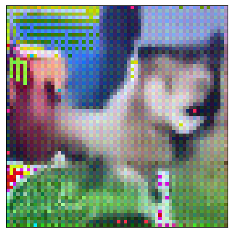

# Diffusion dogs

This is a basic implementation of denoising diffusion probabilistic models ([Ho et al.](https://arxiv.org/abs/2006.11239)) from scratch. The model was trained to generate unseen (non-existent) random images of dogs using the [70 Dog Breeds](https://www.kaggle.com/datasets/gpiosenka/70-dog-breedsimage-data-set)(n=7946) and the [Stanford dogs](https://www.kaggle.com/datasets/jessicali9530/stanford-dogs-dataset)(n=20000) image datasets. The code is inspired by [this notebook](https://colab.research.google.com/drive/1sjy9odlSSy0RBVgMTgP7s99NXsqglsUL?usp=sharing#scrollTo=2fUPyJghdoUA) by DeepFindr which implements diffusion on cars using a UNet denoiser. 

The model was trained for 300 epochs. Example image generations are shown below. While it isn't state-of-the-art we still show that it's outputting images which almost look like dogs. There are some artefacts like noise and checkerboard pattern (due to transposed convs). With some further improvements to the model, we expect this to do better.

**Training images**:


<br>

**Generated images**:





<br>

# Quickstart

Setup environment
```
python -m venv .venv
.venv/bin/activate
pip install -r requirements.txt
```
Generate 3 images with filenames sample{i}
```
cd diffusion_dogs
python generate.py --fname plots/sample -n 3
```